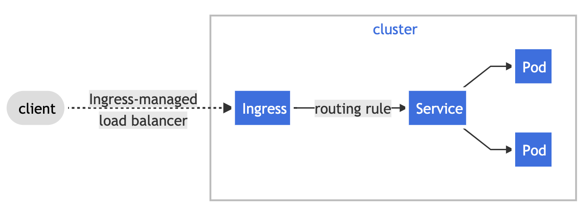

# Introduction 
Ever wonder how certificates and HTTPS actually work ? I know I did for a long time...

For years I pretended that I understood, as it seemed to either be expected as prior knowledge or simply glossed over in many tutorials.

Nowadays, simply knowing how certificates work is not enough. We need to know how to do something useful with this knowledge. Such as deploying HTTPS applications onto the modern platform of choice, Kubernetes.

This hands on session aims to explain what certificates are, how they are used for secure communication and also how we can leverage Kubernetes to deploy HTTPS applications with relative ease. 

# Hands-on Certificates on Kubernetes
This tutorial covers the steps required to deploy both an internal and production ready HTTPS application on a pre-existing Kubernetes cluster built on on Azure Kubernetes Service (AKS).

### Initial setup
SSH into your workstation

    ssh <username>@<ip_address>

Or, alternatively, navigate to `<ip_address>/wetty` in your browser.

Clone down this repoistory

    git clone <this_repo>
    cd <repo_name>

### Deploy a HTTPS Ingress Controller using Helm
In order to deploy our HTTPS application we will utilise the **Ingress** resource, available by default in Kubernetes. 

Ingress exposes HTTP and HTTPS routes from outside the cluster to services within the cluster.

For the built in Ingress resource to work, the cluster must have an **Ingress Controller** running. The Ingress Controller fulfills the mapping of Ingress rules we define.

Ingress controllers are not included by default within a cluster. The most popular controller is provided by NGINX, we can add this to our cluster using **Helm**.

Add the ingress-nginx Helm chart repository
    
    helm repo add ingress-nginx https://kubernetes.github.io/ingress-nginx

Use Helm to deploy an NGINX Ingress Controller
    
    helm install ingress-nginx ingress-nginx/ingress-nginx \
        --set controller.scope.enabled=true \
        --set rbac.scope=true \
        --set controller.admissionWebhooks.enabled=false 

Once this is deployed, we can view the created service and assocaited EXTERNAL_IP (Note: It may take a few seconds to generate the IP)

    kubectl get services ingress-nginx-controller

Set the EXTERNAL_IP as a variable for later use

    EXTERNAL_IP=$(kubectl get services ingress-nginx-controller | awk 'NR==2 {print $4}')

The EXTERNAL_IP of this service acts as an entry point for the outside world.

## Internal App - Self-Signed Certificates 

Generate self-signed TLS certificate using openssl 

    openssl req -x509 -nodes -days 365 -newkey rsa:2048 \
        -out /tmp/tls.crt \
        -keyout /tmp/tls.key \
        -subj "/CN=dpgexample.com"

Create Kubernetes secret for the TLS certificate

    kubectl create secret tls internal-tls-secret \
        --cert /tmp/tls.crt \
        --key /tmp/tls.key

Run the demo application using `kubectl apply`

    kubectl apply -f self-signed/internal-app.yaml

Create the Ingress resource

    kubectl apply -f self-signed/internal-ingress.yaml

Test the Ingress configuration

    curl -v --cacert /tmp/tls.crt --resolve dpgexample.com:443:$EXTERNAL_IP https://dpgexample.com 

In the above curl command we indicate that we trust the self-signed certificate as an internal "CA". 

<!-- `/tmp/tls.crt` contains the public key needed to verify the certificate for `dpgexample.com` was signed by the private key `/tmp/tls.key`. -->

Alternatively on your own machine (not your workstation) modify hosts file and view in browser. This will require sudo access.

Hosts file locations:

`Windows        c:\windows\system32\drivers\etc\hosts`

`Mac & Linux    /etc/hosts`
 

(Note: If the browser prevents you from proceeding, type "thisisunsafe" into the browser window. This should bypass the browsers built in security checks)

## Prod App - Automated Certificates signed by LetsEncypt

Login to Azure using service principal 

    az login --service-principal -u $APP_ID -p $APP_PW --tenant $TENANT_ID

### Configure FQDN for the Ingress Controller EXTERNAL_IP

Because our Kubernetes cluster is hosted on Azure AKS, during the installation of the Ingress Controller an Azure Public IP address is created that corresponds with the service EXTERNAL_IP. We can associate this Azure Public IP with a Fully Qualified Domain Name.

    # Public IP address of your Ingress Controller
    EXTERNAL_IP=$(kubectl get services ingress-nginx-controller | awk 'NR==2 {print $4}')

    # Associate Public IP address with DNS name, we will use the hostname of our workstation as an example
    DNSNAME=$(hostname)

    # Get the Azure resource-id of the Public IP address
    PUBLICIPID=$(az network public-ip list --query "[?ipAddress!=null]|[?contains(ipAddress, '$EXTERNAL_IP')].[id]" --output tsv)

    # Update Public IP address with DNS name
    az network public-ip update --ids $PUBLICIPID --dns-name $DNSNAME

    # Display the FQDN
    az network public-ip show --ids $PUBLICIPID --query "[dnsSettings.fqdn]" --output tsv

    # Set FQDN as variable
    FQDN=$(az network public-ip show --ids $PUBLICIPID --query "[dnsSettings.fqdn]" --output tsv)

We now have a unquie FQDN that we can use for our application.

### Deploy demo application to Kubernetes cluster
Deploy the demo application using `kubectl apply`

    kubectl apply -f LetsEncrypt/prod-app.yaml

### Issue Certificates and configure Ingress
Prior to this interactive session, the Kubernetes **cert-manager** controller has been pre-installed onto the Kubernetes cluster. See `aks-cluster` directory for details.

Cert-manager is a Kubernetes add-on that automates the management and issuance of TLS certificates from various issuing sources, including external CAs.

Create Issuer

    kubectl apply -f LetsEncrypt/issuer.yaml

Update Ingress manifest to use our FQDN

    sed -i "s/<REPLACE_ME>/$FQDN/g" LetsEncrypt/prod-ingress.yaml

Create an Ingress route by applying manifest 

    kubectl apply -f LetsEncrypt/prod-ingress.yaml 

Verify that the certificate was created successfully by checking READY is True, which may take a minute

    kubectl get certificate

Desribe the certificate resource to reveal what happens behind the scenes

    kubectl describe certificate tls-secret

### View HTTPS application in browser
Finally navigate to the the Fully Qualified Domain Name, copy the result of the echo command to your browser

    echo $FQDN 

## Summary
We have now seen how we can deploy HTTPS applicaitons on Kubernetes. We secured an internal application using our own self-sign certificates; and for production we automated the issuance of certificates, signed by a trusted CA (LetsEncrypt), using the Kubernetes **cert-manager** addon.